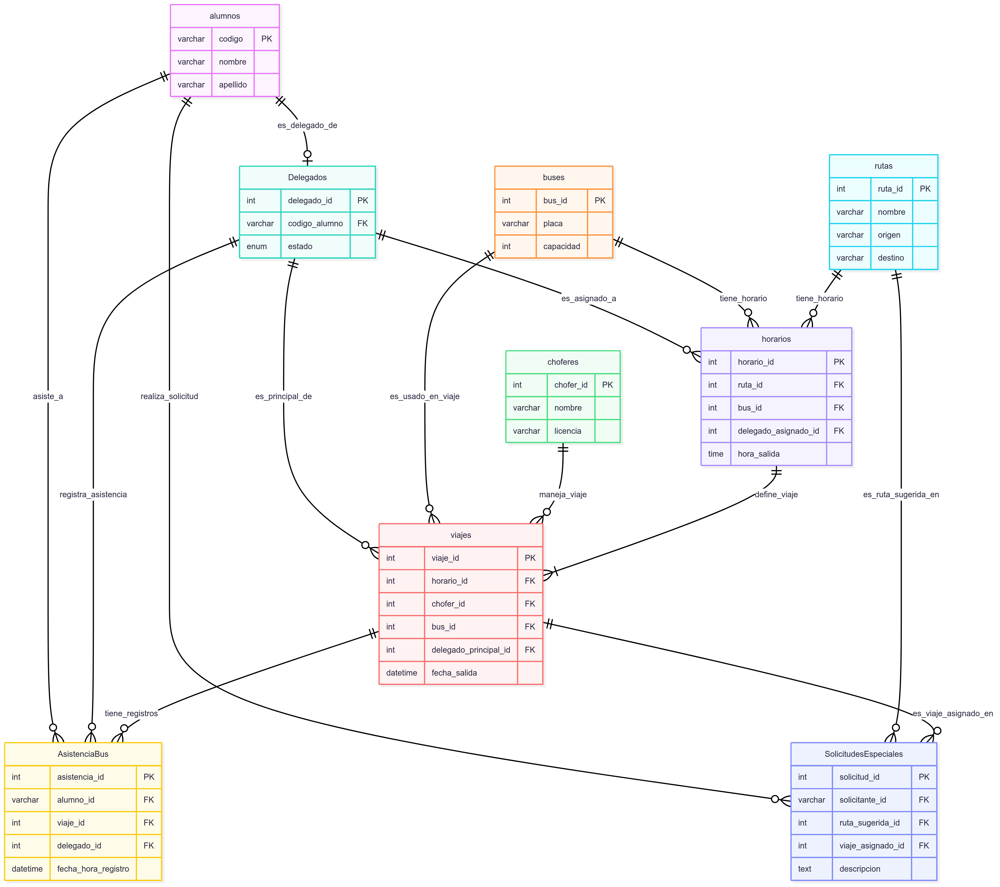

# Descripción del Esquema de Base de Datos

Este documento describe la estructura de la base de datos para el sistema de gestión de asistencia de buses MAIPI, detallando el propósito de cada tabla y las relaciones entre ellas.

## Visión General del Diagrama Entidad-Relación (DER)

Aquí puedes insertar la imagen de tu Diagrama Entidad-Relación (DER). Este diagrama proporcionará una representación visual clara de las tablas y sus conexiones.

## Descripción de las Tablas y sus Relaciones

A continuación, se detalla cada tabla presente en la base de datos:

-----

### 1\. `alumnos`

  * **Propósito**: Almacena la información principal de todos los estudiantes de la universidad.
  * **Columnas Clave**:
      * `codigo` (PRIMARY KEY, UNIQUE, NOT NULL): Identificador único y principal para cada alumno (su código institucional).
      * `dni` (UNIQUE, NOT NULL): Documento Nacional de Identidad del alumno.
      * `nombre`, `apellido`: Datos personales del alumno.
      * `foto_url`: URL o ruta a la foto de perfil del alumno.
  * **Relaciones**: Es la tabla principal de usuarios. Referenciada por `Delegados`, `AsistenciaBus` y `SolicitudesEspeciales` a través de la columna `codigo`.

-----

### 2\. `buses`

  * **Propósito**: Contiene los detalles de los vehículos disponibles para el transporte de estudiantes.
  * **Columnas Clave**:
      * `bus_id` (PRIMARY KEY, AUTO\_INCREMENT): Identificador único para cada bus.
      * `placa` (UNIQUE, NOT NULL): Número de matrícula único del bus.
      * `estado` (ENUM): Indica si el bus está 'activo', 'inactivo' o en 'mantenimiento'.
  * **Relaciones**: Referenciado por `horarios` y `viajes` para especificar qué bus se utiliza en cada horario o viaje particular.

-----

### 3\. `Delegados`

  * **Propósito**: Almacena información sobre los alumnos que tienen el rol de delegado en el sistema.
  * **Columnas Clave**:
      * `delegado_id` (PRIMARY KEY, AUTO\_INCREMENT): Identificador único para cada delegado.
      * `codigo_alumno` (UNIQUE, NOT NULL, FOREIGN KEY): Vincula el registro del delegado con un `alumno` específico (`alumnos.codigo`). Asegura que un `alumno` solo pueda ser delegado una vez.
      * `estado` (ENUM): Indica si el delegado está 'activo' o 'inactivo'.
  * **Relaciones**:
      * **Referencia a `alumnos`**: Un `Delegado` es un `alumno` (`codigo_alumno` -\> `alumnos.codigo`).
      * **Referenciado por `horarios`**: Un `Delegado` puede ser asignado como responsable de un `Horario` (`horarios.delegado_asignado_id`).
      * **Referenciado por `viajes`**: Un `Delegado` puede ser el `delegado_principal_id` de un `Viaje`.
      * **Referenciado por `AsistenciaBus` y `SolicitudesEspeciales`**: Registra qué `Delegado` realizó un registro de asistencia o gestionó una solicitud.

-----

### 4\. `rutas`

  * **Propósito**: Define las diferentes rutas de transporte que operan los buses.
  * **Columnas Clave**:
      * `ruta_id` (PRIMARY KEY, AUTO\_INCREMENT): Identificador único para cada ruta.
      * `nombre`: Nombre descriptivo de la ruta.
      * `origen`, `destino`: Puntos de inicio y fin de la ruta.
      * `duracion_aproximada`: Tiempo estimado que toma completar la ruta.
  * **Relaciones**: Referenciada por `horarios` para asociar un horario a una ruta específica, y opcionalmente por `SolicitudesEspeciales` como ruta sugerida.

-----

### 5\. `choferes`

  * **Propósito**: Almacena los datos de los conductores disponibles para los viajes.
  * **Columnas Clave**:
      * `chofer_id` (PRIMARY KEY, AUTO\_INCREMENT): Identificador único para cada chofer.
      * `dni` (UNIQUE, NOT NULL): Documento de identidad único del chofer.
      * `licencia` (UNIQUE, NOT NULL): Número de licencia de conducir único del chofer.
  * **Relaciones**: Referenciado por `viajes` para asignar un chofer a un viaje particular.

-----

### 6\. `horarios`

  * **Propósito**: Define los horarios de operación regulares de los buses para rutas específicas.
  * **Columnas Clave**:
      * `horario_id` (PRIMARY KEY, AUTO\_INCREMENT): Identificador único para cada horario programado.
      * `ruta_id` (FOREIGN KEY, NOT NULL): Vincula el horario a una `ruta` específica (`rutas.ruta_id`).
      * `bus_id` (FOREIGN KEY, NOT NULL): Asocia el horario a un `bus` específico (`buses.bus_id`).
      * `hora_salida`: Hora programada para la salida.
      * `dias_operacion`: Días de la semana en que opera el horario.
      * `delegado_asignado_id` (FOREIGN KEY): El `delegado` responsable de este horario (`Delegados.delegado_id`).
  * **Relaciones**:
      * **Referencia a `rutas`**: Define qué `ruta` sigue el `horario`.
      * **Referencia a `buses`**: Define qué `bus` se utiliza en este `horario`.
      * **Referencia a `Delegados`**: Asigna un `Delegado` a la supervisión de un `horario`.
      * **Referenciado por `viajes`**: Cada `Viaje` es una instancia de un `Horario` particular.

-----

### 7\. `viajes`

  * **Propósito**: Representa una instancia específica de un viaje programado, con detalles de fecha y estado en tiempo real.
  * **Columnas Clave**:
      * `viaje_id` (PRIMARY KEY, AUTO\_INCREMENT): Identificador único para cada viaje individual.
      * `horario_id` (FOREIGN KEY, NOT NULL): Vincula el viaje a un `horario` predefinido (`horarios.horario_id`).
      * `chofer_id` (FOREIGN KEY, NOT NULL): Asigna un `chofer` al viaje (`choferes.chofer_id`).
      * `bus_id` (FOREIGN KEY, NOT NULL): Asigna un `bus` al viaje (`buses.bus_id`).
      * `fecha_salida`: Fecha y hora real/programada de salida del viaje.
      * `estado` (ENUM): El estado actual del viaje ('programado', 'en\_curso', 'finalizado', 'cancelado').
      * `delegado_principal_id` (FOREIGN KEY): El `delegado` principal asignado a este `viaje` específico (`Delegados.delegado_id`).
  * **Relaciones**:
      * **Referencia a `horarios`**: Cada `viaje` se basa en un `horario` predefinido.
      * **Referencia a `choferes` y `buses`**: Asigna el personal y vehículo a un `viaje`.
      * **Referencia a `Delegados`**: Asigna un `Delegado` principal a la supervisión del `viaje`.
      * **Referenciado por `AsistenciaBus` y `SolicitudesEspeciales`**: Los registros de asistencia y las solicitudes se asocian a un `viaje` específico.

-----

### 8\. `AsistenciaBus`

  * **Propósito**: Registra la asistencia de los alumnos a un viaje de bus específico.
  * **Columnas Clave**:
      * `asistencia_id` (PRIMARY KEY, AUTO\_INCREMENT): Identificador único para cada registro de asistencia.
      * `alumno_id` (FOREIGN KEY, NOT NULL): El `codigo` del `alumno` que ha registrado su asistencia (`alumnos.codigo`).
      * `viaje_id` (FOREIGN KEY, NOT NULL): El `viaje` al que se registra la asistencia (`viajes.viaje_id`).
      * `delegado_id` (FOREIGN KEY): El `delegado` que realizó el registro (`Delegados.delegado_id`).
      * `fecha_hora_registro`: Marca de tiempo de cuándo se realizó el registro.
      * `UNIQUE (alumno_id, viaje_id)`: Garantiza que un mismo alumno no pueda registrarse dos veces para el mismo viaje.
  * **Relaciones**:
      * **Referencia a `alumnos`**: Indica qué `alumno` asistió.
      * **Referencia a `viajes`**: Indica a qué `viaje` asistió el alumno.
      * **Referencia a `Delegados`**: Indica qué `delegado` registró la asistencia.

-----

### 9\. `SolicitudesEspeciales`

  * **Propósito**: Almacena las solicitudes especiales de transporte realizadas por los alumnos o la administración.
  * **Columnas Clave**:
      * `solicitud_id` (PRIMARY KEY, AUTO\_INCREMENT): Identificador único para cada solicitud.
      * `solicitante_id` (FOREIGN KEY, NOT NULL): El `codigo` del `alumno` que realiza la solicitud (`alumnos.codigo`).
      * `tipo_solicitud` (ENUM): Categoría de la solicitud (academica, deportiva, cultural, otros).
      * `fecha_hora_requerida`: Fecha y hora para la cual se solicita el transporte.
      * `ruta_sugerida_id` (FOREIGN KEY): Una `ruta` sugerida para la solicitud (`rutas.ruta_id`).
      * `estado_solicitud` (ENUM): El estado actual de la solicitud ('pendiente', 'aprobada', 'rechazada', 'completada').
      * `viaje_asignado_id` (FOREIGN KEY): El `viaje` que se asigna para cumplir la solicitud, una vez aprobada (`viajes.viaje_id`).
  * **Relaciones**:
      * **Referencia a `alumnos`**: Quién hace la solicitud.
      * **Referencia a `rutas`**: La `ruta` sugerida.
      * **Referencia a `viajes`**: El `viaje` que finalmente cumple la solicitud.

-----
